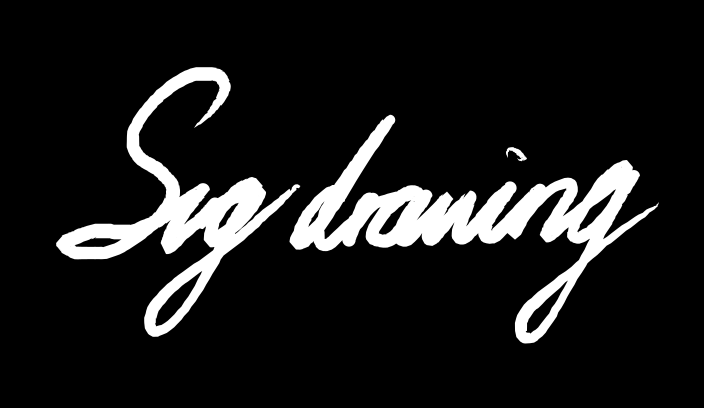

  <picture>
    <source media="(prefers-color-scheme: dark)" srcset="./public/demos/svg-drawing-dark.svg">
    
  </picture>

# svg-drawing

A simple canvas to draw lines and replay rendered as SVG, can be exported as SVG.

# Features

- **Share**
  Share your drawing with a url that contains all the information to replay it, it's limited, see [Problems](#problems). Some share examples [here](./SHARE.md).
- **Brushwork**
  The brushwork's implementation is based on [perfect-freehand](https://github.com/steveruizok/perfect-freehand)

# Problems

- Share limit
  The share link contains all points that you draw, because of the limitation of url length(may be different with browsers), the share info maybe lost, and info cannot be parsed.
- Rendering problems at line intersections.
  When brushwork enabled, it will use mask to implement the effect ( which is inspired by [AntFu](https://github.com/antfu)'s [Animated SVG Logo](https://antfu.me/posts/animated-svg-logo) ). So this problem is hard to resolve for now.

# Roadmap

- [x] Basic Canvas, replay and export
- [ ] Logo
- [x] README
- [x] Canvas size configuration
- [x] Realtime preview
  - [x] Preview as thumbnail
  - [x] Full screen / Original size preview
- [x] Replay configuration
  - [x] Speed
  - [x] Loop
  - [x] Animation easing
- [x] Operation history
  - [x] Undo
  - [x] Redo
- [x] Pen configuration
  - [x] Color
  - [x] Stroke width
- [ ] Export format
  - [x] SVG
  - [ ] GIF (hold)
- [x] Brushwork support
  - See https://github.com/steveruizok/perfect-freehand
- [ ] Import & Export
- [x] Share url
- [ ] Copy svg base64
